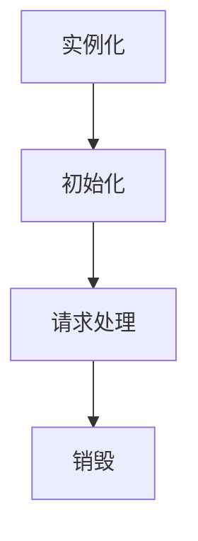

### 1、Filter 概述

`Filter` 过滤器是实现了 `Filter `接口的类，它的主要作用是请求到达目标资源之前对请求进行预处理，或在响应离开目标资源之前对响应进行后处理。

> [!NOTE] 补充：Filter 与 AOP 的区别
> 在Java Web应用程序中，`Filter`和`AOP（面向切面编程）`都都可以用于在应用程序的不同阶段插入额外的逻辑，但它们的侧重点不同：
> - **Filter** ：主要关注于 HTTP 请求和响应的处理，适用于处理跨越多个请求的通用功能，如安全检查、请求日志记录、字符编码等。
> - **AOP** ：更侧重于在方法级别进行横切关注点的处理，例如事务管理、性能监控、业务逻辑的日志记录等。它提供了更细粒度的控制和灵活性，允许在特定方法调用之前、之后或中间插入代码。

---


### 2、Filter 生命周期

`Filter` 对象的生命周期，由 `Servlet` 容器管理，生命周期如下：


==1.实例化==
与 Servlet 不同，Filter 在 Web 应用启动时就会被实例化。Servlet 容器会根据 `web.xml` 中的配置或使用注解（如`@WebFilter`）来识别和实例化所有需要的Filter。

==2.初始化==
在实例化之后，容器会调用Filter的`init`方法来进行初始化。`init` 方法只会调用一次，通常用于读取配置参数或进行一些一次性的设
```
public void init(ServletConfig config) throws ServletException {
    // 初始化代码
}
```

==3.请求处理==
每当有请求到达链中的 `Filter` 或 `Servlet` 时，容器会调用 `Filter` 的 `doFilter` 方法。此方法可以对请求进行处理（如修改请求参数、记录日志等），并决定是否将请求转发给下一个 `Filter` 或最终的 `Servlet`。
```
public void doFilter(ServletRequest request, ServletResponse response, FilterChain chain) 
        throws IOException, ServletException {
    // 处理请求前的逻辑
    chain.doFilter(request, response); // 继续调用下一个过滤器或目标资源
    // 处理请求后的逻辑
}
```

==4.销毁==
当Web应用停止或者Filter被卸载时，容器会调用Filter的 `destroy` 方法。此方法用于释放资源，如关闭数据库连接或清理内存。调用`destroy()`方法后，Filter 实例虽依然存在于内存中，但不再被 Web 容器引用。后续，Java 的垃圾回收机制会在适当的时机对这些内存进行回收。
```
public void destroy() {
    // 清理代码
}
```

---


### 3、编写 Filter

编写 Filter，就要实现 `Filter` 接口：
```java
/**
 * 1. init(FilterConfig filterConfig)：初始化方法，该方法在过滤器被实例化后调用。主要用于执行初始化任务，例如读取 FilterConfig 提供的初始化参数、加载必要资源等。
 * 
 * 2. doFilter(ServletRequest request, ServletResponse response, FilterChain chain) ：过滤方法，用于对请求和响应进行预处理或后处理。该方法可以执行前置逻辑、调用下一个过滤器或最终目标资源，并在返回时执行后置逻辑。
 * 
 * 3. destroy()：销毁方法，在服务器关闭或过滤器被移除时调用。主要用于释放占用资源，例如关闭数据库连接、清理缓存等，确保应用程序正常回收资源。
 */
 
public class MyFilter implements Filter {
    /**
    * FilterConfig：每个 Filter 都有对应的 FilterConfig 对象，提供了 Filter 的初始化参数以及 ServletContext 的访问接口
    * 
    * 1. getInitParameter(String name)：指定名称的初始化参数的值：
    * 2. getInitParameterNames()：所有初始化参数的名称
    * 3. getServletContext()：获取上下文对象 ServeletContext
    * 4. getFilterName()：获取本 Filter 的名称
    */
    @Override
    public void init(FilterConfig filterConfig) throws ServletException {
        System.out.println("MyFilter 初始化！");
    }
	/*
	* FilterChain：主要用于管理和调度一系列过滤器（Filters）。在过滤器链（Filter Chain）中，过滤器按特定顺序一个一个被调用，每个过滤器有机会对请求和响应进行处理，并将它们传递给链中的下一个过滤器。最终，链中的最后一个过滤器将请求交给目标资源（如一个 Servlet）。
	*/
    @Override
    public void doFilter(ServletRequest request, ServletResponse response, FilterChain chain) 
            throws IOException, ServletException {
            
		// 前置逻辑
        System.out.println("MyFilter 开始处理请求...");
        
        // 继续执行下一个过滤器或目标资源
        chain.doFilter(request, response);
        
        // 后置逻辑
        System.out.println("MyFilter 响应返回...");
    }

    @Override
    public void destroy() {
        System.out.println("MyFilter 销毁！");
    }
}
```


> [!NOTE] 注意事项
> 在 `doFilter` 方法中，传入的是 `ServletRequest` 和 `ServletResponse`，一般我们将其转换为 `HttpServletRequest` 和 `HttpServletResponse`
```java
public void doFilter(ServletRequest request, ServletResponse response, FilterChain chain)
        throws IOException, ServletException {
    // 前置逻辑
    HttpServletRequest httpRequest = (HttpServletRequest) request;
    HttpServletResponse httpResponse = (HttpServletResponse) response;  
    
	.......

    // 将请求传递给下一个过滤器或目标资源(固定写法)
    chain.doFilter(request, response);
}
```

---


### 4、配置 Filter
#### 4.1、xml 方式

```
// web.xml

<web-app xmlns="http://xmlns.jcp.org/xml/ns/javaee"
         xmlns:xsi="http://www.w3.org/2001/XMLSchema-instance"
         xsi:schemaLocation="http://xmlns.jcp.org/xml/ns/javaee
                             http://xmlns.jcp.org/xml/ns/javaee/web-app_3_1.xsd"
         version="3.1">

<!-- ===================== 注册 Filter ========================= -->
<!--
  1. Filter 的名称
  2. Filter 的全类名
  3. Filter 是否支持异步处理
  4. Filter 的初始化参数
-->
	<!-- 注册一个 Filter -->
    <filter>
        <!-- 1. Filter 的名称 -->
        <filter-name>MyFilter</filter-name>      
        
        <!-- 2. Filter 的全类名 -->
        <filter-class>com.example.MyFilter</filter-class> 
        
        <!-- 3. Filter 是否支持异步处理，默认值为 false 即不支持 -->
        <async-supported>true</async-supported>          
        
        <!-- 4. Filter 的初始化参数，键和值都是 String 类型的 -->
        <init-param>
            <param-name>param1</param-name>
            <param-value>value1</param-value>
        </init-param>
        <init-param>
            <param-name>param2</param-name>
            <param-value>value2</param-value>
        </init-param>
    </filter>

	
<!-- ===================== 映射 Filter ========================= -->
<!--
  1. Filter 映射的 URL
-->
    <filter-mapping>                                      
        <filter-name>MyFilter</filter-name>                 
        <url-pattern>/admin/*</url-pattern>              
    </filter-mapping>

    <filter-mapping>                                     
        <filter-name>MyFilter</filter-name>                  
        <url-pattern>/user/*</url-pattern>                     
    </filter-mapping>

</web-app>
```

> [!NOTE] 注意事项
> 1.  一个 Filter 可以映射多个 url ，注意 url 不带项目名，但要带 / 前缀
> 2. `<url-pattern>` 中只能写一个路径
> 3. Filter 执行的顺序：若多个 Filter 的 url 相同，按照 `<filter-mapping>` 的先后顺序划分第一过滤器、第二过滤器，其执行的顺序为：第一过滤器前置逻辑 --> 第二过滤器前置逻辑 --> Servlet 处理逻辑 --> 第二过滤器后置逻辑 -->第一过滤器后置逻辑

---


#### 4.2、注解方式
```java
@WebFilter(
    filterName = "MyFilter",                    // Filter 的名称
    asyncSupported = true,                      // Filter 是否支持异步处理
    initParams = {                              // Filter 的初始化参数
        @WebInitParam(name = "param1", value = "value1"),
        @WebInitParam(name = "param2", value = "value2")
    },
    urlPatterns = {"/api", "/admin"}            // Filter 映射的 URL
)     
@Order(1)                                        // Filter 执行的顺序（Spring 环境下，可以使用 @Order 注解来指定过滤器的顺序）
public class MyFilter implements Filter {
    ......
}
```

> [!NOTE] 注意事项
> 1. 如果 Filter 的名称没有写，默认名称是类名的首字母小写
> 2. 如果只需要映射 URL 不需要配置其他的，且只有单个 URL 可以简写为：@WebFilter("/example")
> 3. 如果使用注解配置，需要开启支持注解，即在 web.xml 中要加入 metadata-complete="false"

