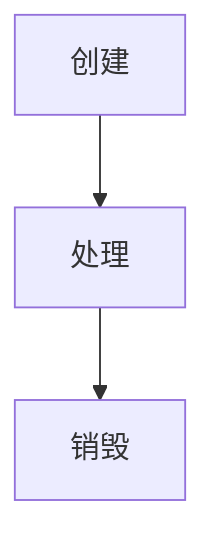

### 1、HttpServletRequest 概述

当 `Servlet` 容器接收到 HTTP 请求后，会解析请求中的信息及数据，并将其完整封装为结构化的 `HttpServletRequest` 对象。此对象不仅完整承载了客户端向服务器发起的 HTTP 请求内容（包括请求行、请求头和请求体等核心元素），还提供了丰富的实例方法让开发者读取请求数据，并进行相应的处理。

---


### 2、HttpServletRequest 生命周期

Servlet 对象的生命周期，由 Servlet 容器管理，生命周期如下：


==1.创建==
当客户端（通常是浏览器）发送 HTTP 请求到服务器时，Servlet 容器创建一个新的 `HttpServletRequest` 对象，包含客户端请求的所有信息，如请求参数、请求头、URI、HTTP 方法等客户端请求信息。

==2.处理==
Servlet 容器将此对象传递给相应的 Servlet 的 service 方法或具体的 doGet、doPost 等方法（取决于请求的 HTTP 方法），开发者可以使用这个对象用来读取请求数据。

==3.销毁==
当 Servlet 完成对请求的处理并返回响应后，此对象不再需要了，Servlet 容器会在请求处理完成后销毁该对象以释放资源。

---


### 3、HttpServletRequest 相关方法

#### 3.1、获取请求行信息

==1.客户端==
```
// 客户端

GET /example/path?name=John&age=30 HTTP/1.1
Host: example.com
```

==2.服务端==
```java
/** 
 * getMethod()：获取 HTTP 请求的 请求方法，如 GET、POST
 * getRequestURI()：获取 HTTP 请求的 URI
 * getProtocol()：获取 HTTP 请求的 查询字符串
 * getContextPath()：获取 Web 应用的上下文路径（项目名）
 * getServletPath()：获取 Servlet 的路径
 * 
 */

@WebServlet("/example")
public class ExampleServlet extends HttpServlet {

    protected void doGet(HttpServletRequest request, HttpServletResponse response) throws ServletException, IOException {
        String method = request.getMethod();
        String uri = request.getRequestURI();
        String queryString = request.getQueryString();
        String protocol = request.getProtocol();
        String contextPath = request.getContextPath();
        String servletPath = request.getServletPath();
        
        // 打印信息
        System.out.println("Method: " + method);
        System.out.println("URI: " + uri);
        System.out.println("Query String: " + queryString);
        System.out.println("Protocol: " + protocol);
        System.out.println("Context Path: " + contextPath);
        System.out.println("Servlet Path: " + servletPath);
    }
}
```

==3.输出结果==
```java
Request URI: /example  
Query String: param1=value1&param2=value2  
Protocol: HTTP/1.1  
Context Path: /myapp  
Servlet Path: /path
```

---


#### 3.2、获取请求头信息

==1.客户端==
```
GET /example HTTP/1.1 
Host: www.example.com 
User-Agent: Mozilla/5.0 
Accept: application/xhtml+xml 
Accept-Language: en-US
```

==2.服务端==
```java
/**
* getHeader(String name): 获取单个请求头值（只返回第一个匹配的值）
* getHeaders(String name): 获取多个请求头值
* getHeaderNames():获取所有请求头的名称
*/
@WebServlet("/example")
public class ExampleServlet extends HttpServlet {

    protected void doGet(HttpServletRequest request, HttpServletResponse response) 
            throws ServletException, IOException {
            
        String userAgent = request.getHeader("Accept"); // 获取 User-Agent 的值
        
        Enumeration<String> acceptHeaders = request.getHeaders("Accept"); // 获取所有 Accept 的值
        
        Enumeration<String> headerNames = request.getHeaderNames(); // 获取所有请求头名称
        
        // 输出结果
        response.setContentType("text/plain");
        response.getWriter().println("User-Agent: " + userAgent);
        
        response.getWriter().println("Accept headers:");
        while (acceptHeaders.hasMoreElements()) {
            response.getWriter().println(" - " + acceptHeaders.nextElement());
        }
        
        response.getWriter().println("All Request Headers:");
        while (headerNames.hasMoreElements()) {
            String headerName = headerNames.nextElement();
            response.getWriter().println(" - " + headerName + ":" + request.getHeader(headerName));
        }
    }
}
```

==3.输出结果==
```
User-Agent: Mozilla/5.0  

Accept headers:
- text/html
- application/xhtml+xml  

All Request Headers:
- Host: [www.example.com](https://www.example.com/)
- User-Agent: Mozilla/5.0
- Accept: text/html
- Accept: application/xhtml+xml
- Accept-Language: en-US
```

---


#### 3.3、获取请求体信息

1. 二进制输入流：通过`getInputStream()`获取请求体的二进制输入流，用于处理二进制数据。
2. 字符输入流：通过`getReader()`获取请求体的字符输入流，用于处理文本数据。

---


#### 3.4、获取请求参数

==1.客户端==
```
GET /example?name=John&age=25&hobby=reading&hobby=coding HTTP/1.1
Host: www.example.com
User-Agent: Mozilla/5.0
Accept: text/html
```

==2.服务端==
```java
/** 
 * getParameter(String name))：获取单个请求参数值（只返回第一个匹配的值）
 * etParameterValues(String name)：获取多个请求参数值（返回所有匹配的值）
 * getParameterMap()：获取所有请求参数的名称和对应值
 */

@WebServlet("/example")
public class ExampleServlet extends HttpServlet {

    protected void doGet(HttpServletRequest request, HttpServletResponse response) 
            throws ServletException, IOException {
            
        String name = request.getParameter("name"); // 获取 name 参数的值
        
        String[] hobbies = request.getParameterValues("hobby"); // 获取 hobby 参数的所有值
        Map<String, String[]> parameterMap = request.getParameterMap(); // 获取所有请求参数
        
        // 输出结果
        response.setContentType("text/plain");
        response.getWriter().println("Name: " + name);
        
        response.getWriter().println("Hobbies:");
        if (hobbies != null) {
            for (String hobby : hobbies) {
                response.getWriter().println(" - " + hobby);
            }
        }
        
        response.getWriter().println("All Request Parameters:");
        for (Map.Entry<String, String[]> entry : parameterMap.entrySet()) {
            response.getWriter().println(" - " + entry.getKey() + ": " + String.join(", ", entry.getValue()));
        }
    }
}
```

==3.输出结果==
```
// 输出结果
Name: John

Hobbies:
 - reading
 - coding

All Request Parameters:
 - name: John
 - age: 25
 - hobby: reading, coding
```

> [!NOTE] 补充：请求参数的类型
> 请求参数类型根据位置不同分为两类：
> 1. 查询字符串（Query String）：是 URL 中 “?” 之后的部分，常用于 GET 请求，如[http://example.com/page?name=John&age=30](http://example.com/page?name=John&age=30) 中 name 和 age 是请求参数。
> 2. 请求体参数（Request Body）：在 POST、PUT 等请求方法中发送的数据，常用于表单提交，如提交 HTML 表单时，表单数据会作为请求体一部分发送。


