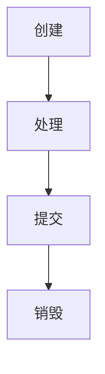

### 1、HttpServletResponse 概述

`HttpServletResponse` 对象用于封装服务端响应客户端 HTTP 请求的所有信息。通过该对象，开发者可以设置响应内容类型、响应头、状态码以及响应体等。当 Servlet 完成请求处理后，便使用 `HttpServletResponse` 对象向客户端返回响应，从而实现对客户端数据和状态信息的精确控制。

---


### 2、HttpServletResponse 生命周期

HttpServletReponse 对象的生命周期如下：


==1.创建==
与 `HttpServletRequest` 对象类似，当客户端发送一个 HTTP 请求时，Servlet 容器会在封装 `HttpServletRequest` 的同时，创建对应的 `HttpServletResponse` 对象，该对象用于生成和返回客户端的 HTTP 响应。

==2.处理==

 Servlet 容器将 `HttpServletResponse` 对象传递给 Servlet 的 `service` 方法，或其具体的 `doGet`、`doPost` 等方法，开发者可以使用该对象来设置响应状态码、响应头以及响应体内容。

==3.提交==
当 Servlet 完成对响应内容的设置后，Servlet 容器会将这些信息发送回客户端。一旦 `HttpServletResponse` 对象的内容被提交给客户端，该对象就不能再被修改。

==4.销毁==
与 `HttpServletRequest` 对象一样，`HttpServletResponse` 对象在响应被发送回客户端后会被`Servlet` 容器销毁，从而释放资源。

---


### 3、HttpServletResponse 相关方法

#### 3.1、设置状态行信息
```java
/**
* 1. setStatus(int sc)：手动设置响应的状态码，但不会自动发送错误页面。适用于未发生错误但需要自定义响应状态时使用。后续代码会继续执行。
* 2. sendError(int sc)：发送错误响应并设置状态码，服务器会自动生成与状态码对应的默认错误页面。适用于发生错误时，直接告知客户端错误状态码（如 404 或 500）。后续代码不会再执行。
* 3. sendError(int sc, String msg)：发送错误响应并设置状态码，同时提供自定义错误信息，客户端会显示该信息。适用于发生错误时，除了告知客户端错误状态码外，还希望提供更详细的错误说明，帮助用户理解错误原因。后续代码不会再执行。
*/

public class StatusServlet extends HttpServlet {

    @Override
    protected void doGet(HttpServletRequest request, HttpServletResponse response) 
            throws ServletException, IOException {
        String action = request.getParameter("action");

        if ("ok".equals(action)) {
            response.setStatus(HttpServletResponse.SC_OK);
            response.getWriter().write("Response with 200 OK");

        } else if ("notfound".equals(action)) {
            response.sendError(HttpServletResponse.SC_NOT_FOUND);

        } else if ("customerror".equals(action)) {
            response.sendError(HttpServletResponse.SC_BAD_REQUEST, "Custom error message: Invalid Request");

        } else {
            response.setStatus(HttpServletResponse.SC_BAD_REQUEST);
            response.getWriter().write("Invalid action parameter.");
        }
    }
}
```

---


#### 3.2、设置响应头信息

##### 3.2.1、设置响应头
```java
/**
* 1. setHeader(String name, String value): 设置响应头。如果该头部已经存在，则会覆盖原有的值。
* 2. addHeader(String name, String value): 添加响应头，如果头部已经存在，则会新的值到现有值的后面，而不是覆盖原有值。
* 3. setContentType(String type): 设置响应内容的类型（例如 text/html）。该内容类型告诉客户端如何解析和呈现响应体的内容。
*/

public class MyHttpServlet extends HttpServlet {

    // 实现 setHeader() 方法：设置 HTTP 响应头
    @Override
    protected void doGet(HttpServletRequest request, HttpServletResponse response) throws IOException {
        // 设置一个响应头
        response.setHeader("Custom-Header", "HeaderValue");

        // 通过 setHeader() 设置其他响应头
        response.setHeader("Cache-Control", "no-cache");

        // 设置响应内容类型
        response.setContentType("text/html");

        // 响应内容
        response.getWriter().println("<html><body><h1>setHeader Example</h1></body></html>");
    }

    // 实现 addHeader() 方法：添加新的 HTTP 响应头
    @Override
    protected void doPost(HttpServletRequest request, HttpServletResponse response) throws IOException {
        // 使用 addHeader() 方法添加新的响应头
        response.addHeader("X-Additional-Header", "AdditionalValue");

        // 设置响应内容类型
        response.setContentType("application/json");

        // 响应内容
        response.getWriter().println("{\"message\": \"addHeader Example\"}");
    }

    // 实现 setContentType() 方法：设置响应内容类型
    @Override
    protected void doPut(HttpServletRequest request, HttpServletResponse response) throws IOException {
        // 设置响应内容类型
        response.setContentType("application/xml");

        // 响应内容
        response.getWriter().println("<message>setContentType Example</message>");
    }
}

```

---


##### 3.2.2、重定向响应
```java
/**
* 1. sendRedirect(String location): 发送重定向响应。
*/
public class RedirectServlet extends HttpServlet {

    @Override
    protected void doGet(HttpServletRequest request, HttpServletResponse response) throws IOException {
        // 使用 sendRedirect() 实现重定向
        response.sendRedirect("https://www.example.com");
    }
}
```

---


#### 3.3、设置响应体信息

```java
/**
* 1. getOutputStream()：用于获取一个 OutputStream，通过这个输出流可以向响应体中写入字节数据，适用于返回二进制数据时，例如图片、视频等文件。
* 2. getWriter()：用于获取一个 PrintWriter，通过这个字符流可以向响应体中写入文本数据，适用于返回文本数据时，例如 HTML、JSON 或纯文本。
*/

public class ImageServlet extends HttpServlet {
	// 使用 getOutputStream() 返回图片
    @Override
    protected void doGet(HttpServletRequest request, HttpServletResponse response) throws IOException {
        // 设置响应类型为图片类型
        response.setContentType("image/jpeg");

        // 获取输出流
        OutputStream out = response.getOutputStream();

        // 读取图片文件并写入响应
        FileInputStream fileInputStream = new FileInputStream("path_to_image.jpg");
        byte[] buffer = new byte[1024];
        int bytesRead;
        while ((bytesRead = fileInputStream.read(buffer)) != -1) {
            out.write(buffer, 0, bytesRead);
        }

        // 关闭流
        fileInputStream.close();
        out.close();
    }
    
    // 使用 getWriter() 返回文本
	@Override
    protected void doGet(HttpServletRequest request, HttpServletResponse response) throws IOException {
    
        // 设置响应内容类型为 HTML
        response.setContentType("text/html");

        // 获取 PrintWriter
        PrintWriter out = response.getWriter();

        // 输出 HTML 内容
        out.println("<html>");
        out.println("<head><title>Servlet Example</title></head>");
        out.println("<body>");
        out.println("<h1>Hello, World!</h1>");
        out.println("<p>This is a response from a servlet.</p>");
        out.println("</body>");
        out.println("</html>");
        
        // 关闭输出流
        out.close();
    }
}
```

---


