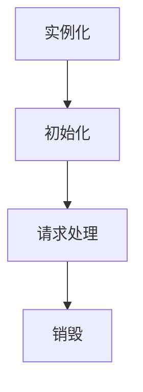

### 1、Servlet 概述
`Servlet` 是实现了 `Servlet` 接口的类，是 `JavaWeb` 应用程序中用于处理客户端请求、执行核心业务、并生成动态响应的服务器端程序。

---


### 2、Servlet 生命周期

Servlet 对象的生命周期，由 Servlet 容器管理，生命周期如下：


==1.实例化==
默认情况下，当用户发送请求时，Servlet 容器会检测到需要加载的 Servlet 类，并通过调用无参构造方法来创建该 Servlet 实例。

> [!NOTE] 注意事项
> 如果希望在服务器启动时就加载 Servlet 类，可以在 Servlet 注册时，在 `<servlet>` 标签中添加 `<load-on-startup>` 子标签。这样，Servlet 类将在服务器启动时被实例化，并存储在服务器的内部数据结构中。

==2.初始化==
在实例化之后，容器会调用 Servlet 的 `init` 方法进行初始化。`init` 方法只会调用一次，在 Servlet 实例化后调用一次，用于执行任何一次性的设置任务
```java
public void init(ServletConfig config) throws ServletException {
	// 初始化代码
}
```

==3.请求处理==
初始化完成后，Servlet 进入请求处理阶段。每次有请求到达时，容器会调用 Servlet 的 `service、doGet、doPost` 等方法进行处理。
```java
public void service(ServletRequest req, ServletResponse res) throws ServletException, IOException {
    // 请求处理代码
}
```

==4.销毁==
当Web应用停止运行，或者Servlet实例达到预设的存活时间时，Web容器会率先调用该Servlet的`destroy()`方法。此方法主要用于清理Servlet在运行过程中占用的资源，诸如关闭数据库连接、终止后台线程等。在调用`destroy()`方法后，Servlet 实例虽仍留存于内存之中，但Web容器不再对其进行引用。后续，Java的垃圾回收机制会在合适的时机对这些内存进行回收。
```
public void destroy() {
    // 资源释放代码
}
```

---


### 3、编写 Servlet

#### 3.1、实现方式

Servlet 的实现方式一般有三种：
1. 实现 `Servlet` 接口（最基本方式，较少使用）
2. 继承 `GenericServlet` 类（较少使用）
3. 继承 `HttpServlet` 类（推荐使用）

---


#### 3.2、实现 `Servlet` 接口

`Servlet` 接口是用于定义一个 `Servlet` 类必须实现的方法的核心接口。下面是 `Servlet` 接口的方法
```java
/**
* 1. init(ServletConfig config) ：初始化 Servlet，Servlet 被创建时会调用此方法一次，通常用于初始化工作，如加载配置文件、建立数据库连接或获取初始化参数等。
* 2. getServletConfig()：返回 Servlet 配置信息，此方法一般用来获取 Servlet 的初始化参数。
* 3. service(ServletRequest req, ServletResponse res) ：处理请求并生成响应，每次请求到达时都会调用此方法。
* 4. getServletInfo()：返回关于 Servlet 的简短信息，通常用于调试或日志记录。
* 5. destroy() ：当 Servlet 被销毁时调用，通常用于清理资源，如关闭数据库连接、释放内存等。
*/

public class MyServlet implements Servlet {

    // 1. 初始化 Servlet。
    @Override
    public void init(ServletConfig config) throws ServletException {
        System.out.println("MyServlet initialized!");
        // 可以使用 config 获取初始化参数，如 config.getInitParameter("paramName");
    }

    // 2. 返回 Servlet 配置信息。
    @Override
    public ServletConfig getServletConfig() {
        // 返回当前 Servlet 的配置信息
        return null;  // 此处返回 null，实际中可返回 ServletConfig 对象
    }

    // 3. 处理请求并生成响应。
    @Override
    public void service(ServletRequest req, ServletResponse res) throws ServletException, IOException {
        // 设置响应内容类型为 HTML
        res.setContentType("text/html");

        // 获取输出流，向客户端发送响应
        PrintWriter out = res.getWriter();

        // 获取请求中的参数 "name"
        String name = req.getParameter("name");

        // 向客户端发送 HTML 格式的响应内容
        out.println("<html><body>");
        out.println("<h1>Hello, " + (name != null ? name : "Guest") + "!</h1>");
        out.println("</body></html>");
    }

    // 4. 返回关于 Servlet 的简短信息。
    @Override
    public String getServletInfo() {
        return "MyServlet - A simple servlet implementation";
    }

    // 5. Servlet 的销毁方法
    @Override
    public void destroy() {
        System.out.println("MyServlet destroyed!");
        // 这里可以释放资源，如关闭数据库连接
    }
}
```

---


#### 3.3、继承 `GenericServlet` 类

`GenericServlet` 是一个抽象类，实现了 `Servlet` 接口的部分方法，简化了 `Servlet` 的开发（如提供了 `init()` 和 `destroy()` 的默认实现），不依赖于具体的协议（如 HTTP），在继承 `GenericServlet` 类时，一般只实现 `Service` 方法，当然也可以实现其他方法
```java
/**
* 1. service(ServletRequest req, ServletResponse res) :处理请求并生成响应，每次请求到达时都会调用此方法。
*/

public class MyServlet extends GenericServlet {

    // 1. 处理请求并生成响应。
    @Override
    public void service(ServletRequest req, ServletResponse res) throws ServletException, IOException {
        // 设置响应内容类型为 HTML
        res.setContentType("text/html");

        // 获取输出流，向客户端发送响应
        PrintWriter out = res.getWriter();

        // 获取请求中的参数 "name"
        String name = req.getParameter("name");

        // 向客户端发送 HTML 格式的响应内容
        out.println("<html><body>");
        out.println("<h1>Hello, " + (name != null ? name : "Guest") + "!</h1>");
        out.println("</body></html>");
    }
}
```

---


#### 3.4、继承 `HttpServlet` 类

`HttpServlet` 类是 `GenericServlet` 的子类，专门用于处理 HTTP 协议的请求。在继承 `GenericServlet` 后，通常只需使用 `HttpServlet` 提供的便利方法，根据不同的 HTTP 请求类型（如 GET、POST 等）进行处理。
```java
/**
* 1. doGet(HttpServletRequest req, HttpServletResponse resp)：处理 Get 请求
* 2. doPost(HttpServletRequest req, HttpServletResponse resp)：处理 Post 请求
* 3. doPut(HttpServletRequest req, HttpServletResponse resp)：处理 Put 请求
* 4. doDelete(HttpServletRequest req, HttpServletResponse resp)：处理 Delete 请求
* 5. doHead(HttpServletRequest req, HttpServletResponse resp)：处理 Head 请求
* 6. doOptions(HttpServletRequest req, HttpServletResponse resp)：处理 Options 请求
* 7. doTrace(HttpServletRequest req, HttpServletResponse resp)：处理 Trace 请求
*/

public class MyHttpServlet extends HttpServlet {

    // 1. 处理 GET 请求
    @Override
    protected void doGet(HttpServletRequest req, HttpServletResponse resp) throws ServletException, IOException {
        resp.setContentType("text/html");
        PrintWriter out = resp.getWriter();
        out.println("<html><body>");
        out.println("<h1>GET request handled</h1>");
        out.println("<p>Hello, this is a response to a GET request!</p>");
        out.println("</body></html>");
    }

    // 2. 处理 POST 请求
    @Override
    protected void doPost(HttpServletRequest req, HttpServletResponse resp) throws ServletException, IOException {
        resp.setContentType("text/html");
        PrintWriter out = resp.getWriter();
        String name = req.getParameter("name");
        out.println("<html><body>");
        out.println("<h1>POST request handled</h1>");
        out.println("<p>Hello, " + (name != null ? name : "Guest") + "!</p>");
        out.println("</body></html>");
    }

    // 3. 处理 PUT 请求
    @Override
    protected void doPut(HttpServletRequest req, HttpServletResponse resp) throws ServletException, IOException {
        resp.setContentType("text/html");
        PrintWriter out = resp.getWriter();
        out.println("<html><body>");
        out.println("<h1>PUT request handled</h1>");
        out.println("<p>Data has been updated!</p>");
        out.println("</body></html>");
    }

    // 4. 处理 DELETE 请求
    @Override
    protected void doDelete(HttpServletRequest req, HttpServletResponse resp) throws ServletException, IOException {
        resp.setContentType("text/html");
        PrintWriter out = resp.getWriter();
        out.println("<html><body>");
        out.println("<h1>DELETE request handled</h1>");
        out.println("<p>Data has been deleted!</p>");
        out.println("</body></html>");
    }

    // 5. 处理 HEAD 请求（与 GET 类似，但不返回响应体）
    @Override
    protected void doHead(HttpServletRequest req, HttpServletResponse resp) throws ServletException, IOException {
        resp.setContentType("text/html");
        resp.setStatus(HttpServletResponse.SC_OK); // 设置响应状态码
    }

    // 6. 处理 OPTIONS 请求（返回支持的 HTTP 方法）
    @Override
    protected void doOptions(HttpServletRequest req, HttpServletResponse resp) throws ServletException, IOException {
        resp.setContentType("text/html");
        resp.setHeader("Allow", "GET, POST, PUT, DELETE, HEAD, OPTIONS, TRACE");
        PrintWriter out = resp.getWriter();
        out.println("<html><body>");
        out.println("<h1>OPTIONS request handled</h1>");
        out.println("<p>Allowed methods: GET, POST, PUT, DELETE, HEAD, OPTIONS, TRACE</p>");
        out.println("</body></html>");
    }

    // 7. 处理 TRACE 请求（用于诊断服务器的请求和响应）
    @Override
    protected void doTrace(HttpServletRequest req, HttpServletResponse resp) throws ServletException, IOException {
        resp.setContentType("text/html");
        PrintWriter out = resp.getWriter();
        out.println("<html><body>");
        out.println("<h1>TRACE request handled</h1>");
        out.println("<p>This is the trace of the request and response.</p>");
        out.println("</body></html>");
    }
}
```

> [!NOTE] 补充：编写 Servlet 类为什么选择继承 GenericServlet 类 或 HttpServlet 类？
> 你可能会疑惑，为什么不直接实现 Servlet 接口，而常使用后面两种方式呢？
> 
> 这是因为，尽管 Servlet 接口定义了多个方法，但在实际开发中，我们通常只需要实现 `service` 方法。因此，直接实现 Servlet 接口会带来一些不必要的复杂性。为了解决这个问题，`GenericServlet` 和 `HttpServlet` 应运而生。
> 
> `GenericServlet` 提供了对 `Servlet` 接口的基本实现，简化了开发过程。而 `HttpServlet` 进一步扩展了 `GenericServlet`，专门用于处理 HTTP 请求，提供了更为便捷的方法，例如 `doGet`、`doPost` 等，极大地方便了 Web 应用的开发。因此，使用 `GenericServlet` 和 `HttpServlet` 可以使开发过程更加高效和简洁。

---


### 4、配置 Servlet

#### 4.1、xml 方式
```xml
// web.xml

<web-app xmlns="http://xmlns.jcp.org/xml/ns/javaee"
         xmlns:xsi="http://www.w3.org/2001/XMLSchema-instance"
         xsi:schemaLocation="http://xmlns.jcp.org/xml/ns/javaee
                             http://xmlns.jcp.org/xml/ns/javaee/web-app_3_1.xsd"
         version="3.1">

<!-- ===================== 注册 Servlet ========================= -->
<!--
  1. Servlet 的名称
  2. Servlet 的全类名
  3. Servlet 是否支持异步处理
  4. Servlet 加载时的优先级
  5. Servlet 的初始化参数
-->
	<!-- 注册一个 Servlet -->
	<servlet>
	    <!-- 1. Servlet 的名称-->
	    <servlet-name>MyServlet</servlet-name>
	
	    <!-- 2. Servlet 的全类名-->
	    <servlet-class>com.example.MyServlet</servlet-class>
	
	    <!-- 3. Servlet 加载时的优先级，指定 Servlet 在应用启动时是否立即加载以及加载的优先级，     数值越小越先加载，若不指定，当 HTTP 请求到达此 Servlet 时加载。
	    -->
	    <load-on-startup>1</load-on-startup>
	
	    <!-- 4. Servlet 是否支持异步处理，默认值为 false 即不支持异步处理，如果设置为 true，则      可以在 Servlet 中使用异步处理功能。
	    -->
	    <async-supported>true</async-supported>
	
	    <!-- 5. Servlet 的初始化参数，键和值都是 String 类型的-->
	    <init-param>
	        <param-name>param1</param-name>
	        <param-value>value1</param-value>
	    </init-param>
	    <init-param>
	        <param-name>param2</param-name>
	        <param-value>value2</param-value>
	    </init-param>
	</servlet>
	
<!-- ===================== 映射 Servlet ========================= -->
<!--
  1. Servlet 映射的 URL
-->
    <servlet-mapping>
        <servlet-name>MyServlet</servlet-name>                  
        <url-pattern>/myservlet1</url-pattern>               >
    </servlet-mapping>

    <servlet-mapping>
        <servlet-name>MyServlet</servlet-name> 
        <url-pattern>/myservlet2</url-pattern>                   
    </servlet-mapping>

</web-app>
```

> [!NOTE] 注意事项
> 1. 一个 Servlet 可以映射多个 url ，注意 url 不带项目名，但要带 / 前缀
> 2. `<url-pattern>` 中只能写一个路径

---


#### 4.2、注解方式

```java
@WebServlet(
    name = "ExampleServlet",                      // Servlet 的名称
    loadOnStartup = 1,                            // Servlet 加载时的优先级
    asyncSupported = true,                        // Servlet 是否支持异步处理
    initParams = {                                // Servlet 的初始化参数
        @WebInitParam(name = "param1", value = "value1"),
        @WebInitParam(name = "param2", value = "value2")
    },
    urlPatterns = "{"/example1,/example2"}"        // Servlet 映射的 URL
)
public class ExampleServlet extends HttpServlet {
    .......
}
```

> [!NOTE] 注意事项
> 1. 如果 Servlet 的名称没有写，默认名称是类名的首字母小写
> 2. 如果只需要映射 URL 不需要配置其他的，且只有单个 URL 可以简写为：@WebFilter("/example")
> 3. 如果使用注解配置，需要开启支持注解，即在 web.xml 中要加入 metadata-complete="false"


