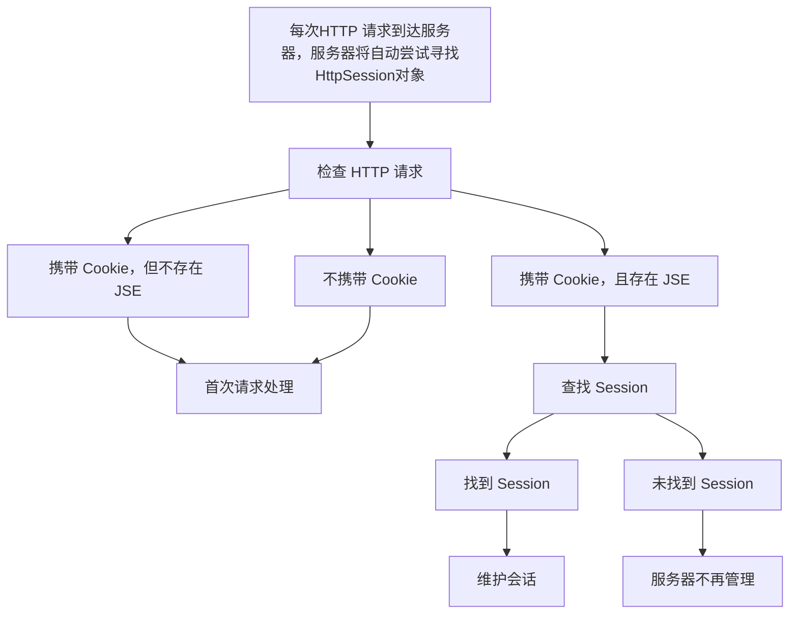

### 1、HttpSession 概述

当用户首次访问网站时，如果请求中没有携带 `Cookie` 或者 `Cookie` 中不包含 `JSESSIONID`，服务器会自动在内存中生成一个 `HttpSession` 对象。这个对象不仅保存了会话的创建时间和最后一次访问时间，还允许程序员存放自定义数据。存放在 `HttpSession` 中的数据的键为 `String` 类型，值可以是任意数据类型（如 `String`、`Integer` 等）。

当用户发出后续请求时，服务器会自动查找与 `JSESSIONID` 相关联的 `HttpSession` 对象。由于 `HttpSession`  中的数据在该会话的上下文中有效，因此这些数据被称为会话域数据。

---


### 2、HttpSession 工作原理


1、检查 HTTP 请求

当客户端发送 HTTP 请求到服务器时，服务器会检查 HTTP 请求中是否包含`Cookie`且存在`JSESSIONID`。

1. 如果`Cookie`中存在`JSESSIONID`，服务器会从请求头中提取该`Session ID`，每个 Session 都有一个唯一的 Session ID，用于识别和引用该会话。服务器将尝试在服务器的内存中查找与该`Session ID`关联的会话数据（即 Session）。
2. 如果不包含 `Cookie` 或 `Cookie` 中不存在 `JSESSIONID` ,服务器认为用户是首次请求，进行首次请求处理

2、查找 Session

服务器根据 `Session ID` 在内存中查找 Session

1. **找到Session**: 如果找到相应的Session，服务器会加载该Session的数据，并更新其最后访问时间。
2. **未找到Session**: 如果未找到有效的Session（例如Session过期或无效），服务器会保持当前状态，不会自动创建新的会话，这意味着后续的操作依赖于程序员的处理，例如：
  1. 直接获取会话：调用 `request.getSession(true)`
  2. 先不获取会话：调用 `request.getSession(false)` 返回 `null`

3、首次请求处理

若请求中没有携带`Cookie`或`Cookie` 中不携带`JSESSIONID`，服务器会在内存中创建一个新的 Session，并分配一个唯一的`Session ID`。在响应时，该`Session ID`通过HTTP响应头的`Set-Cookie`字段返回客户端，作为新的`JSESSIONID`，存储在浏览器的`Cookie`中。

---


### 3、HttpSession 操作方法

#### 3.1、数据相关方法

##### 3.1.1、存储数据
```
// 注意：值可以是任何 Java 对象（如 `String`、`Integer`、`List`、自定义对象等）
session.setAttribute("username","JohnDoe");
```

---


##### 3.1.2、读取数据
```
// 获取数据，一般要进行类型转换
String username = (String) session.getAttribute("username");
```

---


##### 3.1.3、读取所有数据的名称
```
// 获取会话中所有数据名称的枚举。
Enumeration<String> attributeNames = session.getAttributeNames();
while (attributeNames.hasMoreElements()) {
    String attributeName = attributeNames.nextElement();
    response.getWriterO.println("Attribute Name: " + attributeName);
}
```

---


##### 3.1.4、删除数据
```
session.removeAttribute("username");
```

---


#### 3.2、HttpSession 相关方法
##### 3.2.1、获取或创建 HttpSession
```
/*
根据 Session ID 在服务器内存中查找 Session，若 Session 存在，返回 Session，若 Session 不存在，则创建一个新的会话，返回这个新的会话，并在响应时自动返回一个新的 JSESSIONID
*/
HttpSession session = request.getSession(true);
HttpSession session = request.getSession();

/*
根据 Session ID 在服务器内存中查找 Session，若 Session 存在，返回 Session，若 Session 不存在，返回 null
*/
HttpSession session = request.getSession(false);
```

---


##### 3.2.2、释放 HttpSession
```
/*
会话何时释放：
    1. 服务器关闭：由于会话存储在内存中，服务器关闭时会释放所有会话。
    2. 超时未活动：如果会话在设定的最大不活动时间内没有进行任何操作，服务器会自动释放该会话。
    3. 调用 invalidate() 方法：当调用 `void invalidate()` 方法时，会立即释放会话
*/

// 1.通过设置超时未活动时间（单位是秒）
session.setMaxInactiveInterval(300); // 5分钟

// 2.调用 invalidate() 方法
session.invalidate();
```

---


##### 3.2.3、获取 JSESSIONID
```
String sessionId = session.getId();
```


##### 3.2.4、获取 HttpSession 的创建时间
```
// 注意：返回自 1970 年 1 月 1 日以来的毫秒数。
long creationTime = session.getCreationTime();
```

---


##### 3.2.5、获取 HttpSession 最后一次访问时间
```
// 注意：返回自 1970 年 1 月 1 日以来的毫秒数。
long lastAccessedTime = session.getLastAccessedTime();
```

---


##### 3.2.6、获取 HttpSession 允许的最大不活动时间
```
// 注意：返回的单位为秒
int interval = session.getMaxInactiveInterval();
```